👋 Hi, I'm Shaikh Habib Ali

IMCA Student · Software & Web Development · Data Analytics · AI & ML Learner

  
  

🚀 About Me

💻 Building ELECTROCART MW, a full-stack Django e-commerce web application.

📊 Completed the Google Data Analytics Professional Certificate.

🤖 Currently learning AI & Machine Learning.

🌱 Interested in software development, data analytics, and practical AI applications.

🧩 I enjoy learning through hands-on projects and solving practical problems.

🛠️ Tech Stack

Languages & Web

  
  
  
  
  

Frameworks, Databases & Tools

  
  
  
  
  

⚡ Featured Project

<table>
<tr>
<td width="100%">

🛒 ELECTROCART MW

Full-Stack Django E-Commerce Web Application

A product-focused electronics e-commerce platform built with Python, Django, HTML, CSS, JavaScript and SQLite.

Highlights

Product catalogue with brands, categories, specifications and inventory

Product variants, images, pricing and stock management

Cart, wishlist, checkout and order workflows

Coupons, reviews and invoice/order management

Django admin, migrations and reusable management commands

Git/GitHub based development workflow

  

</td>
</tr>
</table>

📊 GitHub Analytics

  
  

Note: The language card reflects code distribution across eligible public repositories; it is not a measure of programming skill.

🔥 Contribution Streak

  

📈 Contribution Activity

  <picture>
    <source media="(prefers-color-scheme: dark)" srcset="assets/lifetime.dark.svg">
    <source media="(prefers-color-scheme: light)" srcset="assets/lifetime.light.svg">
    
  </picture>

📌 GitHub Highlights

  

📫 Connect With Me

  
  
  

💡 Learn · Build · Analyze · Improve

